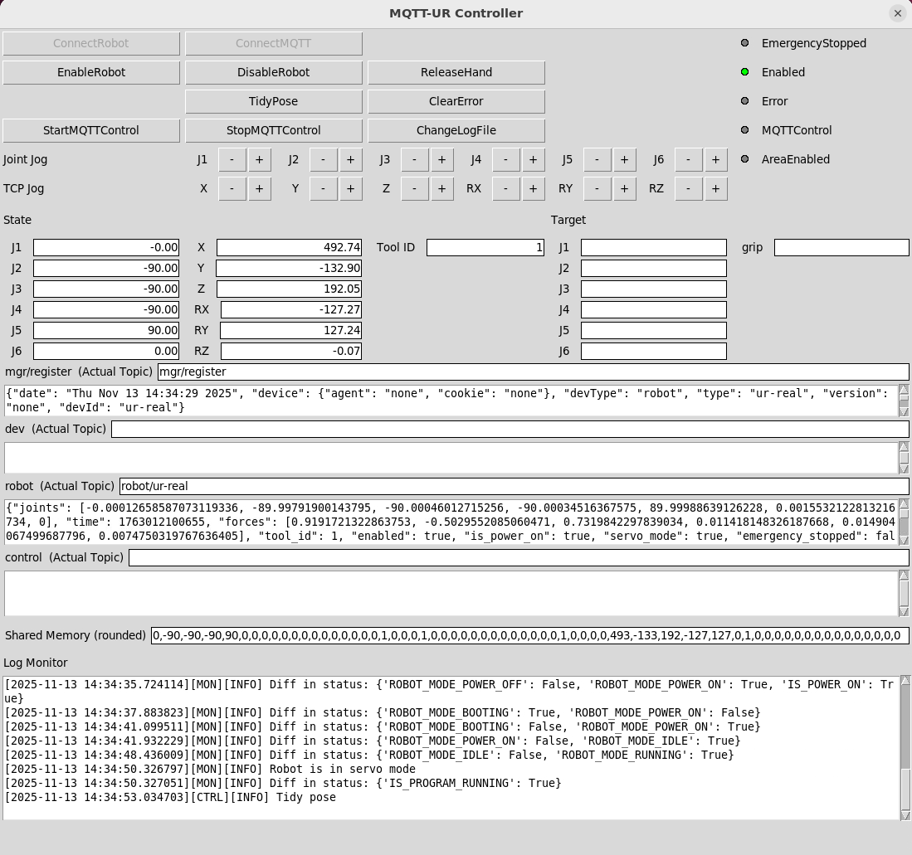

# UR_MQTT_Control マニュアル

MetaworkMQTTプロトコルでの、UR-5eの実機側の制御プログラムの使い方を説明する。

制御プログラムの開発環境での実行を前提とする。

## クイックスタート

**1 ロボットの起動**

- ティーチペンダント（TP、正式名称とバージョンはPolyscope 5.17.0）上の電源ボタンを押して起動
- TP画面上側のタブのLocal / RemoteをLocalにする（TPから操作する用）
- タブのOpen... -> Installation -> epick_w_extension_20251023.installationを選択 -> Openで、事前の設定値を読み込む（ツールのTCP、Payloadを設定している）
- タブのLocal / RemoteをRemoteにする（遠隔PCから操作する用）
- 緊急停止ボタンがOFFである（上に引いてある）ことを確認する。また、ロボット制御時に、緊急停止したい場合は緊急停止ボタンをONにする（押す）ことを確認しておく

**2 PCでのプログラム実行**

- **NOTE: VRシステムと結合しての動作確認は未検証である**
- ロボット接続用PCとロボットコントローラはLAN接続する。LANのPC側は10.5.5.101/24、ロボットコントローラ側は10.5.5.102/24（TPで設定可能）に設定する。開発環境では設定済みである
- 開発環境では、プログラムは`/home/uclab/UR_remote_codes/UR_MQTT_Control`にインストールされている（`pyenv local`を使用）。インストールの方法は[インストール](#インストール)参照
- 開発環境では、ロボット制御コードは以下のコマンドで実行できる

```sh
sudo $(pyenv which python) src/main.py
```

`sudo $(pyenv which python)`とするのは、リアルタイムスケジューラを利用するための設定である。この手法では、一時的にバイナリ（`python`）にリアルタイムスケジューラを利用するための権限を付与することができ、また仮想環境の`python`を用いる場合でも使用することができる。`pyenv`で`sudo`を使わずにリアルタイムスケジューラを設定する方法は未検証。

以下のようなGUI画面が起動する。



ロボット制御側で、MQTTでの制御を受け付けるようにするためには、以下の手順で操作を行う。

1. `ConnectRobot`でロボットに接続
2. `ConnectMQTT`でMQTTサーバーに接続
3. `EnableRobot`でロボットの状態に応じて電源ONやロボットコントローラの制御プログラム起動などを行う。すべて成功すれば`Enabled`のランプが緑色に点灯する
4. `StartMQTTControl`でMQTTでの制御を受け付けるようにする。成功すれば`MQTTControl`のランプが緑色に点灯する

MQTTでの制御中に、エラーが起きた場合は、1度自動復帰を試みる。成功した場合、そのままMQTTでの制御が可能である。失敗した場合は、MQTTでの制御が止まる。

エラーが残っている場合、`Error`のランプが赤色に点灯する。エラーを解除して大丈夫な状態（アームが障害物に衝突してエラーが起きた後に、障害物を取り除くなどした安全な状態）であれば、`ClearError`でエラー表示を消した後、`EnableRobot`でロボットコントローラの制御プログラムを起動すればよい。

`ReleaseHand`でハンドを最大まで開くことができる。`TidyPose`でロボットの先端がロボットの台の中央付近になり、先端が縦向きになる、片付け用の姿勢に移動できる。`ChangeLogFile`でログ出力ディレクトリを現在の時刻の`log/<YY-mm-dd>/<HH-MM-SS>`に切り替えることができる。`DisableRobot`でモーターをOFFにできる。閉じるボタンでロボット制御コードを終了できる。

ジョグ（関節空間でのジョグは`Joint Jog`, ベース座標系（X, Y, X, RX, RY, RZ）でのジョグは`TCP Jog`）が可能である。ジョグは長押しするとジョグ速度が大きくなる。ベース座標系でのジョグは特異姿勢付近でエラーになることがある。

**3 VRシステムを使用しないリアルタイム制御の動作確認**

VRシステムと結合しての動作確認が未検証なので、以下のスクリプトを使ってMQTTを使わずに共有メモリ上の目標関節角度を書き換えることで、URに対応させた制御・モニタプロセスのリアルタイム制御時の動作確認を行った。これにより、アームのリアルタイム制御中でもハンドを同時に制御できることを確認した。

開発環境では以下のコマンドで実行できる。

```sh
sudo $(pyenv which python) src/check_replay_from_target.py --target-path experiments/dummy_control.jsonl --log-dir experiments/log_dummy_control --use-joint-monitor-plot
```

`experiments/dummy_control.jsonl`は、関節J1, J6それぞれの時系列が振幅30度、周期5sのほぼ正弦波を4回繰り返す軌跡で、その途中にグリップの吸引/開放を3回行う入力情報が定義されている。結果は`experiments/log_dummy_control/<YY-mm-dd>/<HH-MM-SS>`に格納される。`--use-joint-monitor-plot`で目標値、制御値、状態値のリアルタイム表示ができる。

**4 ロボットの終了**

- TPの右上のアイコン -> Shutdown Robotで終了できる

## インストール

開発環境では、プログラムは`/home/uclab/UR_remote_codes/UR_MQTT_Control`にインストール済みだが、ここではプログラムをインストールする方法を説明する。

まず、プログラムのレポジトリからクローンする:

```sh
git clone -b develop --recurse-submodules https://github.com/t-kubo-tome/UR_MQTT_Control.git
```

レポジトリのパス、ブランチは変更される可能性あり。

URの制御には、外部モジュール`ur_rtde`のレポジトリ（`https://gitlab.com/sdurobotics/ur_rtde`）を一部改変したレポジトリ（`https://gitlab.com/t-kubo-tome/ur_rtde`）のブランチ（`feature/epick-realtime-control`）を使用している。これをサブモジュールとして登録しているので、オプション`--recurse-submodules`を使用している。

次に、Pythonの仮想環境を作成し、起動しておく。

次に、必要なライブラリをインストールする:

```sh
pip install -r src/requirements.txt
```

次に、`ur_rtde`をビルド、インストールする:

```sh
cd src/vendor/ur_rtde
pip install .
# 元の場所に戻る
cd ../../..
```

環境変数は、`src/ur/.env.example`の変数を適宜書き換え、`src/ur/.env`に変更することで有効になる。
